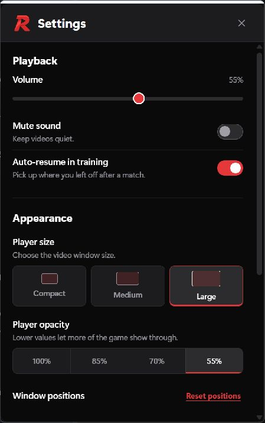

<p align="center">
  
</p>

<h1 align="center">Rot</h1>

<p align="center"><strong>Watch during Free Play. Focus when the match starts.</strong></p>

<p align="center">
  A small YouTube player for Rocket League training.<br>
  Pauses and hides as training ends, then resumes when training is verified again.
</p>

<p align="center">
  <a href="https://github.com/bkaranf/Rot/releases/latest/download/Rot-win-x64.zip"><strong>Download for Windows</strong></a> ·
  <a href="#get-started">Get started</a> ·
  <a href="docs/TROUBLESHOOTING.md">Troubleshooting</a> ·
  <a href="https://github.com/bkaranf/Rot/releases">Release notes</a> ·
  <a href="https://github.com/bkaranf/Rot/issues/new?template=readme-feedback.yml">Give feedback</a>
</p>


Rot is a free, open-source Windows app for players who watch videos while warming
up or waiting for a match. It uses Rocket League's local Stats API and ordinary
Windows windows. It does not inject into the game.

## Get started

**Requires:** Windows 11 x64, Rocket League through Epic Games Launcher,
Borderless or Windowed mode, and the
[Microsoft Edge WebView2 Runtime](https://developer.microsoft.com/microsoft-edge/webview2/consumer/).
The portable download includes .NET 10. You do not need to install the SDK.

1. [Download Rot](https://github.com/bkaranf/Rot/releases/latest/download/Rot-win-x64.zip)
   and extract the whole ZIP into a user-writable folder.
2. Close Rocket League for first setup, then run **Rot.exe**.
3. Launch Rocket League normally and enter **Play > Training > Free Play**.
4. Press **Ctrl+Shift+F** to open Browse and choose a YouTube video.

Rot checks its three local Stats API settings at startup. If a repair was needed
while the game was open, restart the game fully. No EAC-off launch is required.

For Settings or Quit, right-click the red **R** in the Windows notification area.
Open the **^** menu beside the clock if the icon is tucked away. Settings works
without the game running. Launching Rot again opens the existing Settings window.

## Built around a training session

| Feature | What it does |
|---|---|
| Automatic pause and resume | Watches the local training lifecycle, hides as training ends, and waits for verified training before restoring. |
| A movable player | Resize it, choose opacity, and keep your window layout between sessions. |
| Click-through | Let clicks reach the game, with a shortcut and tray Settings available to restore interaction. |
| Editable shortcuts | Capture your preferred chords, see conflicts, and restore defaults from Settings. |
| Reliable preferences | Save changes automatically, retain prior values after failed writes, and recover a previous snapshot when possible. |
| Optional Send to Rot | Choose a video in your normal browser and send its address with one click. |
| Explicit updates | Check for a release from About Rot and install it with staged replacement and rollback. |

The Player never takes keyboard focus. Browse and game-opened Settings are
interactive. Switching to another app pauses and hides the Player. Browse remains
permanently muted.

<p align="center">
  
  <br><em>The actual Rot Settings window on Windows. Your layout and preferences may differ.</em>
</p>

## Choose videos in your normal browser

Use your signed-in browser's YouTube recommendations, then click the optional
**Send to Rot** extension. The selected video waits until Rocket League is in
verified local training and has focus.

[Install Send to Rot for Chrome or Edge](browser-extension/README.md).

Only the address is transferred. Google sign-in, cookies and YouTube Premium do
not transfer into Rot. Embedded Browse stays signed out, and YouTube may show ads.
You can also use Browse directly, paste a YouTube address, or enter a video ID.

## Default shortcuts

Change these in **Settings > Help > Keyboard shortcuts**.

| Action | Shortcut |
|---|---|
| Show or hide Player | Ctrl+Shift+Y |
| Open or close Browse | Ctrl+Shift+F |
| Play or pause | Ctrl+Shift+K |
| Mute or unmute | Ctrl+Shift+M |
| Next video in the current playlist | Ctrl+Shift+N |
| Cycle opacity | Ctrl+Shift+O |
| Toggle click-through | Ctrl+Shift+P |

## Know the limits

- Use **Borderless** or **Windowed** mode. Ordinary desktop windows cannot reliably
  appear above exclusive fullscreen.
- Other Windows editions are unverified. Check Microsoft's
  [.NET 10 supported systems](https://github.com/dotnet/core/blob/main/release-notes/10.0/supported-os.md)
  before attempting an older Windows installation.
- Rot targets the Epic Games version of Rocket League. The integration is not an
  anti-cheat certification or a guarantee about future game updates.
- Videos that disable embedding, require sign-in, or have age restrictions may
  need to play in your normal browser. YouTube controls ads and video quality.
- Automatic playback follows recognized training, transition and online signals.
  If no valid event arrives for about five seconds, Rot mutes, pauses and hides.
  Some incomplete events can keep the connection active without changing the last
  recognized state. See [how detection works](docs/TROUBLESHOOTING.md#detection-is-disconnected-or-needs-repair).
- With Rocket League focused, Player shortcuts still allow manual playback while
  detection is disconnected or connected but waiting for verified training. This
  fallback does not verify training. When online play is detected, Rot's online safety
  rules still apply: Show or hide can reveal only a paused, muted warning.
- The emergency player fallback uses YouTube's own controls. Its exact timestamp
  may not survive a reload.

Read [validation and known gaps](VALIDATION.md) for the scope of testing.

## Privacy

No Rot accounts, telemetry, analytics or subscriptions. Preferences and the
WebView2 profile stay under `%LOCALAPPDATA%\Rot`. Update checks run when requested.
The browser extension requests only `activeTab` and `nativeMessaging`.

Rot receives Stats API data without sending game commands. It does not read game
memory, capture the game screen, simulate input or modify YouTube pages.
[Privacy and local data](docs/PRIVACY.md) explains the details.

## Build or contribute

First clone or download the [source repository](https://github.com/bkaranf/Rot).
The portable ZIP contains the ready-to-run app, not the source build tools.
Install the .NET SDK specified in [global.json](https://github.com/bkaranf/Rot/blob/main/global.json)
and Node.js 22 or later. On Windows, from the source repository root:

```powershell
dotnet restore Rot.sln
dotnet build Rot.sln -c Release --no-restore
dotnet test Rot.sln -c Release --no-build
node --test
node scripts/check-repository.mjs
powershell -ExecutionPolicy Bypass -File .\scripts\publish.ps1
```

The portable build is written to `dist\Rot-win-x64`. Read
[CONTRIBUTING.md](CONTRIBUTING.md) for format checks, preview tools and test boundaries.
The [architecture decisions](DECISIONS.md) explain the game and browser integration.

Found a problem? Start with [troubleshooting](docs/TROUBLESHOOTING.md), then
[open an issue](https://github.com/bkaranf/Rot/issues/new/choose) with your version
and reproduction steps. Small, focused contributions are welcome.

## License and acknowledgments

Rot source and original artwork are available under the [MIT license](LICENSE).
See [third-party notices](THIRD-PARTY-NOTICES.md) for bundled components.
Rocket League and YouTube belong to their respective owners. Rot is an independent
project and is not affiliated with or endorsed by Psyonix, Epic Games or Google.
