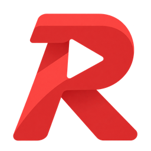
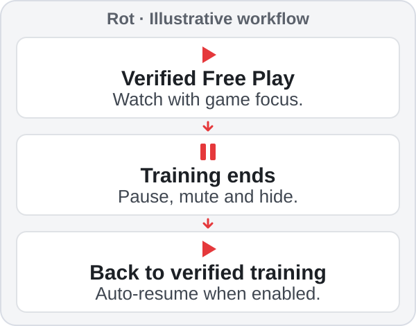
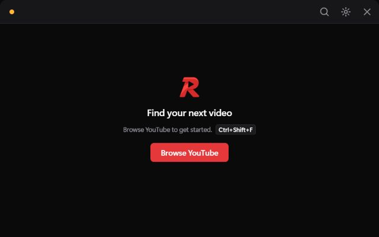
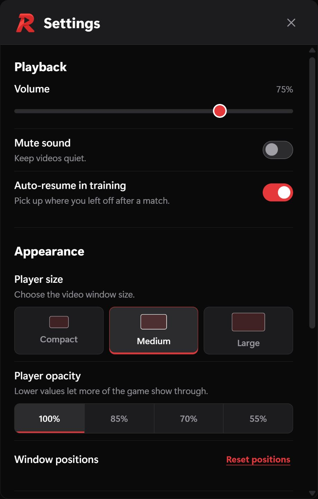

  

<h1 align="center">Rot</h1>

<strong>Watch during Free Play. Focus when the match starts.</strong>

  A small Windows YouTube player for Rocket League training.

  <a href="https://github.com/bkaranf/Rot/releases/latest/download/Rot-win-x64.zip"><strong>Download for Windows</strong></a> ·
  <a href="#get-started">Get started</a> ·
  <a href="docs/TROUBLESHOOTING.md">Troubleshooting</a> ·
  <a href="https://github.com/bkaranf/Rot/issues/new?template=readme-feedback.yml">README feedback</a>

  

Rot is an open-source Windows app for watching videos during Rocket League
training. It reads Rocket League's [local Stats API](DECISIONS.md#why-retain-the-stats-api)
for training state. Playback
uses an ordinary desktop window and does not inject into the game.

## Get started

**Requires:** Windows 11 x64, Rocket League installed through the Epic Games
Launcher, Borderless or Windowed mode, and the
[Microsoft Edge WebView2 Runtime](https://developer.microsoft.com/microsoft-edge/webview2/consumer/).
The portable download includes .NET 10, so you do not need the SDK.

1. [Download Rot for Windows](https://github.com/bkaranf/Rot/releases/latest/download/Rot-win-x64.zip)
   and extract the entire ZIP into a folder you can write to.
2. Close Rocket League for first setup, then run **Rot.exe**.
3. Launch Rocket League normally and enter **Play > Training > Free Play**.
4. Press **Ctrl+Shift+F** to open Browse and choose a YouTube video.

Expected result: in focused, verified Free Play, the video plays in the Rot
window. When training ends, Rot mutes, pauses and hides the Player. If
**Auto-resume in training** is enabled, it returns only after fresh local
training is verified.

At startup, Rot checks three local Stats API settings. If it repairs them while
the game is running, restart Rocket League. You do not need to disable Easy
Anti-Cheat. For **Settings** or **Quit**, right-click the red **R** in the
notification area, or open the **^** menu beside the clock if it is hidden.
Settings works with the game closed, and launching Rot again opens it.

## Make training easier

- **Stay focused:** the video gets out of your way as training ends.
- **Keep your layout:** resize and move the Player, choose opacity, and retain
  your window arrangement between sessions.
- **Keep control:** click-through lets input reach the game, while shortcuts and
  tray Settings restore control when you need it.
- **Start from your normal browser:** the optional [Send to Rot extension](browser-extension/README.md)
  sends a YouTube address and waits for verified training and Rocket League focus.

Browse and Settings accept keyboard and mouse input, while the Player never takes
keyboard focus. Browse is always muted. Switching to another app pauses and hides
the Player.

See the Player interface

  
   <em>Player interface preview before a video is selected. Captured from Rot’s web UI without Rocket League.</em>

  
   <em>Settings interface captured from Rot's UI source at 2× resolution. Shown with default preferences.</em>

## YouTube and browser limits

Browse is signed out. Google sign-in, cookies and YouTube Premium benefits do
not transfer into Rot, and YouTube may show ads. Paste a YouTube address or
video ID, or use the optional extension above. Videos that disable embedding,
require sign-in, or have age restrictions may need the normal browser through
the Player's **Open on YouTube** action. YouTube controls ads and video quality.

## Know before installing

- Rot targets the Epic Games version of Rocket League. Use Borderless or Windowed
  mode; exclusive fullscreen is not reliable for ordinary desktop windows.
- After the first valid Stats event, about five seconds without another valid
  event causes Rot to mute, pause and hide. Some incomplete events can keep the
  connection active without changing the last recognized state. See
  [how detection works](docs/TROUBLESHOOTING.md#detection-is-disconnected-or-needs-repair).
- With Rocket League focused, Player shortcuts still allow manual playback while
  detection is disconnected or waiting for verified training. This fallback does
  not verify training. When online play is detected, **Show or hide Player** can
  reveal only a paused, muted warning.
- Rot is not an anti-cheat certification and does not promise compatibility with
  future game updates. Other Windows versions have not been verified.

## Privacy and validation

Rot has no accounts, telemetry, analytics or subscriptions. Preferences and the
WebView2 profile stay under <code>%LOCALAPPDATA%\Rot</code>. It receives local
Stats API data without sending game commands, reading game memory, capturing the
game screen, simulating input or modifying YouTube pages.

Read [Privacy and local data](docs/PRIVACY.md), [validation and known gaps](VALIDATION.md),
[release notes](https://github.com/bkaranf/Rot/releases), and [third-party notices](THIRD-PARTY-NOTICES.md).

## Get help or contribute

Start with [Troubleshooting](docs/TROUBLESHOOTING.md) for setup and playback help.
For a reproducible problem, use the [issue form](https://github.com/bkaranf/Rot/issues/new/choose)
with your Rot version, Windows version and concise steps. Quick feedback is also
welcome through the [README feedback form](https://github.com/bkaranf/Rot/issues/new?template=readme-feedback.yml).

To contribute, read [CONTRIBUTING.md](CONTRIBUTING.md) and work from the
[source repository](https://github.com/bkaranf/Rot). Rot source and original
artwork are under the [MIT license](LICENSE). Rocket League and YouTube belong
to their owners; Rot is independent of Psyonix, Epic Games and Google.

Keyboard shortcuts

Change these in **Settings > Help > Keyboard shortcuts**.

| Action | Shortcut |
|---|---|
| Show or hide Player | Ctrl+Shift+Y |
| Open or close Browse | Ctrl+Shift+F |
| Play or pause | Ctrl+Shift+K |
| Mute or unmute | Ctrl+Shift+M |
| Next video in the current playlist | Ctrl+Shift+N |
| Cycle opacity | Ctrl+Shift+O |
| Toggle click-through | Ctrl+Shift+P |

Build from source

The portable ZIP contains the ready-to-run app, not the source build tools.
Install the .NET SDK specified in [global.json](https://github.com/bkaranf/Rot/blob/main/global.json) and Node.js 22 or
later. From the source repository root on Windows:

~~~powershell
dotnet restore Rot.sln
dotnet build Rot.sln -c Release --no-restore
dotnet test Rot.sln -c Release --no-build
npm test
node scripts/check-repository.mjs
powershell -ExecutionPolicy Bypass -File .\scripts\publish.ps1
~~~

The portable build is written to <code>dist\Rot-win-x64</code>. See [CONTRIBUTING.md](CONTRIBUTING.md)
for format checks, preview tools and test boundaries.

